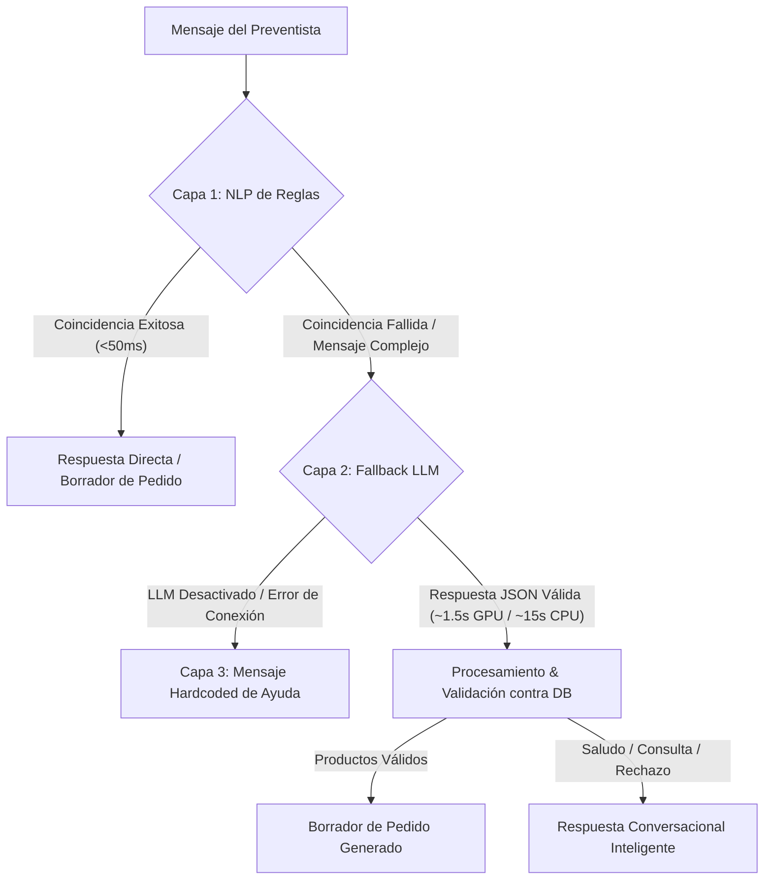

# Preventista Inteligente AJE — Análisis Completo del Agente LLM y Guía de Operación

Este documento contiene un análisis detallado sobre el funcionamiento del agente de lenguaje masivo (LLM) integrado como mecanismo de **fallback** en el proyecto **Emergentes Preventista**. Aquí se documenta cómo está implementado, cómo interactúa con el NLP tradicional, cómo funciona el proceso de entrenamiento simulado por épocas, sus puntos críticos de rendimiento y la guía paso a paso para asegurar su correcto funcionamiento en producción.

---

## 1. Arquitectura de Procesamiento de Lenguaje Natural (Dual-Core)

El sistema de chat y parsing del backend de FastAPI utiliza una arquitectura híbrida de dos capas para garantizar velocidad y flexibilidad:



### 1.1 Capa 1: NLP Basado en Reglas (Determinista)
- **Implementación**: `backend/app/routes/nlp.py` (~2170 líneas).
- **Mecanismo**: Tokenización, normalización de jerga, cálculo de similitud (Levenshtein/Fuzzy matching) y búsqueda en base de datos local o Supabase de alias de productos predefinidos.
- **Ventaja**: Extremadamente rápido (tiempo de respuesta inferior a 100ms) y 100% predecible.
- **Desventaja**: Rígido. Si el usuario escribe mensajes que no siguen la estructura de un pedido (por ejemplo, saludos informales, preguntas conversacionales o jergas complejas no registradas), el NLP de reglas no puede procesarlo y retorna `None`.

### 1.2 Capa 2: Fallback LLM (Generativo / Probabilístico)
- **Implementación**: `backend/app/services/llm.py` y `backend/app/routes/chat.py`.
- **Mecanismo**: Invocación local a través de **Ollama** utilizando el modelo personalizado `aje-preventista` (basado en `llama3.1:8b`).
- **Ventaja**: Capaz de entender la intención del usuario a nivel semántico. Interpreta modismos bolivianos, detecta productos a partir de sinónimos implícitos y devuelve respuestas estructuradas en formato JSON bajo reglas de negocio estrictas.
- **Desventaja**: Mayor consumo de recursos computacionales y latencia variable dependiendo del hardware (CPU vs. GPU).

---

## 2. Funcionamiento y Configuración de Ollama Local

Para evitar la dependencia de APIs pagas (como OpenAI o Anthropic) y garantizar la privacidad total de los datos de AJE Bolivia, el LLM se ejecuta **localmente** utilizando **Ollama**.

### 2.1 Variables de Entorno (`.env`)
El comportamiento del servicio LLM se configura a través del archivo `.env` en el directorio `backend/`:

| Variable | Tipo | Valor Recomendado | Descripción |
|---|---|---|---|
| `LLM_FALLBACK_ENABLED` | Boolean | `true` | Habilita o deshabilita la Capa 2. Si está en `false`, el sistema ignora Ollama y usa el fallback hardcoded de inmediato. |
| `OLLAMA_URL` | String | `http://localhost:11434` | Endpoint HTTP del daemon de Ollama local. |
| `OLLAMA_MODEL` | String | `aje-preventista` | Nombre del modelo personalizado generado tras el entrenamiento. |
| `OLLAMA_TIMEOUT` | Float | `30.0` | Tiempo de espera máximo en segundos para la inferencia del modelo antes de abortar. |

### 2.2 Ciclo de Vida del Modelo: Cold-Start y Warmup
Uno de los problemas más comunes en LLMs locales es el **cold-start** (tiempo que toma cargar el modelo de 4.9 GB desde el disco hacia la memoria RAM o VRAM en la primera petición, que puede durar más de 30 segundos).

- **Mitigación**: En `backend/app/services/llm.py` se implementa la función `warmup()`.
- **Llamada Automática**: Se ejecuta en el startup de FastAPI mediante el gestor de ciclo de vida (`lifespan`) en `backend/app/main.py`.
- **Acción**: Envía un prompt mínimo de prueba al iniciar el servidor, forzando a Ollama a cargar el modelo en RAM/VRAM para que las llamadas de los usuarios sean instantáneas desde el primer mensaje.

---

## 3. Entrenamiento Progresivo con Épocas (`train_llm_model.py`)

Debido a que no es un fine-tuning tradicional por re-entrenamiento de pesos (el cual requeriría hardware de alto rendimiento y mucho tiempo), el script `train_llm_model.py` implementa un **entrenamiento simulado a nivel de prompt** mediante la generación de un **Modelfile de Ollama** con ejemplos conversacionales (Few-Shot Learning) embebidos directamente en el modelo a nivel de sistema.

### 3.1 Anatomía del Modelfile de Ollama
El script de entrenamiento compila un archivo temporal con la estructura necesaria para que Ollama compile el nuevo modelo:

```dockerfile
FROM llama3.1:8b

# Configuración de hiperparámetros
PARAMETER temperature 0.05
PARAMETER top_p 0.9
PARAMETER num_predict 512

# System Prompt base inyectado
SYSTEM """
Eres el asistente virtual de pedidos de bebidas de la empresa AJE Bolivia.
Tu función es interpretar mensajes de preventistas que hacen pedidos en lenguaje natural boliviano coloquial.
...
"""

# Ejemplos conversacionales (Few-Shot baked-in)
MESSAGE user "mandame 2 sielitos de litro"
MESSAGE assistant "{\"intencion\":\"pedido\",\"motivo_rechazo\":null,\"productos\":[{\"nombre_detectado\":\"sielitos\",\"cantidad\":2,\"presentacion\":\"1L\",\"sku_sugerido\":\"Agua Cielo 1L\"}],\"mensaje_libre\":null}"
```

### 3.2 Dinámica de las Épocas
El proceso simula la progresión de épocas incrementando el volumen de datos de entrenamiento expuesto al modelo en cada paso:

1. **Carga y Conversión**: Carga el dataset piloto `cochabamba_cercado_orders.json` (74 ejemplos) y los convierte en pares de turnos `user` ⇄ `assistant` en formato JSON string estructurado.
2. **Ciclo de Épocas**:
   - **Época 1**: Construye un Modelfile con el primer 33% del dataset. Crea el modelo `aje-preventista-e1`.
   - **Época 2**: Modelfile con el 66% del dataset. Crea el modelo `aje-preventista-e2`.
   - **Época 3**: Modelfile con el 100% del dataset. Crea el modelo `aje-preventista-e3`.
3. **Evaluación de Métricas**:
   Por cada época, el modelo resultante es evaluado contra un conjunto de control (muestra del propio dataset) midiendo:
   - **Intent Accuracy (40%)**: Si clasifica correctamente si el mensaje es un `pedido`, `saludo`, `consulta_catalogo` o `fuera_de_alcance`.
   - **Product Hit Rate (40%)**: Si detecta correctamente los productos del catálogo y los asocia a sus SKUs oficiales.
   - **Quantity Accuracy (20%)**: Si extrae correctamente las cantidades numéricas especificadas.
   - **Latencia promedio**: El tiempo de respuesta de inferencia por token.
4. **Selección**: Calcula un score ponderado de efectividad y compila el modelo final `aje-preventista` utilizando el set de ejemplos de la época que obtuvo el mejor rendimiento global.

---

## 4. Puntos Críticos para el Funcionamiento Correcto

Para asegurar que el agente LLM funcione de forma óptima y no introduzca inestabilidad o demoras en la aplicación móvil, se deben monitorear y optimizar los siguientes puntos críticos:

### 🔴 4.1 Requisitos de Hardware y GPU (Crítico para Latencia)
El modelo `llama3.1:8b` quantizado a 4 bits (`Q4_K_M`) pesa aproximadamente **4.9 GB**. Su rendimiento cambia drásticamente según el hardware donde corre el servidor de backend:

- **Ejecución en CPU**: Si Ollama no tiene acceso a una tarjeta gráfica NVIDIA, la inferencia se ejecutará en CPU (usando hilos del procesador). La latencia por cada mensaje de chat subirá a **entre 12 y 25 segundos**. Esto generará timeouts en la aplicación móvil y una experiencia de usuario inaceptable.
- **Ejecución en GPU (Recomendado)**: Con una GPU de gama media-alta (ej. NVIDIA RTX 3060/4060 o superior con al menos **8 GB de VRAM** dedicada), el modelo cabe por completo en la memoria gráfica. La latencia se reduce a **1 - 3 segundos**, lo cual es perfectamente tolerable para un fallback de chat interactivo.
- **Acción requerida**: El host de producción debe tener instalados los drivers oficiales de NVIDIA y el plugin de contenedor GPU si se despliega en Docker, permitiendo que Ollama detecte y use CUDA.

### 🔴 4.2 Control Estricto del Formato de Salida (JSON Enforcement)
El backend espera que el LLM devuelva **exclusivamente** un objeto JSON válido que contenga la estructura:
```json
{
  "intencion": "pedido" | "consulta_catalogo" | "saludo" | "fuera_de_alcance",
  "motivo_rechazo": null | "solid_food" | "alcohol" | "sin_stock",
  "productos": [
    {
      "nombre_detectado": "...",
      "cantidad": 1,
      "presentacion": "...",
      "sku_sugerido": "..."
    }
  ],
  "mensaje_libre": "..."
}
```
Si el modelo responde con explicaciones en lenguaje natural (ej. *"Aquí tienes tu pedido en formato JSON: {...}"*) o incluye bloques markdown (````json ... ````), el parseador fallará.

- **Mecanismos de Defensa Implementados**:
  1. **Hiperparámetro `temperature` a 0.05**: Obliga al modelo a ser determinista y seguir el formato instruido, limitando su creatividad.
  2. **Regex Extractor en `_extract_json()`**: Limpia posibles delimitadores markdown o espacios en blanco antes de parsear.
  3. **Auto-Retry (1 reintento)**: Si el parsing de JSON falla en la primera respuesta, `ask_llm()` realiza una segunda llamada de inmediato agregando una advertencia crítica al final del prompt (`[IMPORTANTE: Responde SOLO con un objeto JSON válido...]`).

### 🟠 4.3 Alineación contra el Catálogo Real de la Base de Datos
El LLM opera de manera generativa, por lo que podría sufrir de **alucinaciones** e inventar productos que no existen en AJE Bolivia, o sugerir marcas de la competencia.

- **Mitigación**: `ask_llm()` no usa un catálogo estático quemado en el código. En su lugar, el backend consulta los productos activos de la base de datos (SQLite local o Supabase) y genera un listado formateado que se inyecta dinámicamente en el prompt del sistema antes de enviarlo a Ollama:
  ```python
  catalog_text = build_catalog_text(products)
  ```
- **Post-Procesamiento en `chat.py`**: El backend **nunca** asume que el `sku_sugerido` por el LLM es correcto por sí solo. Cuando el LLM devuelve un pedido con productos extraídos, el archivo `chat.py` realiza un cruce de validación estricto buscando el producto por su nombre oficial en la DB. Si no coincide, se descarta o se marca para aclaración humana.

### 🟠 4.4 Filtrado de Productos No Autorizados (Alcohol y Comida Sólida)
De acuerdo a las reglas de negocio de AJE Bolivia, el agente preventista no debe procesar pedidos de productos de la competencia, alcohol o alimentos sólidos.

- **Defensa Integrada**: El system prompt incluye reglas específicas sobre esto (sinónimos como `cheba`, `chela`, `birra`, `papitas`, `nachos` catalogados explícitamente para rechazo). El modelo debe cambiar la intención a `fuera_de_alcance` y setear el `motivo_rechazo` a `"alcohol"` o `"solid_food"`.
- **Defensa en Backend**: El backend tiene una validación secundaria por reglas para palabras prohibidas en caso de que el LLM alucine y deje pasar un pedido de cerveza.

---

## 5. Guía de Operación y Checklist de Despliegue

Sigue estos pasos para instalar, configurar y verificar que el LLM funcione correctamente en cualquier entorno (desarrollo o producción).

### Paso 1: Instalación de Ollama
Ollama debe estar corriendo en la misma máquina que el backend (o en un servidor accesible vía red interna):

- **Linux / macOS**:
  ```bash
  curl -fsSL https://ollama.com/install.sh | sh
  ```
- **Windows**: Descarga el instalador oficial desde [ollama.com](https://ollama.com).

### Paso 2: Descargar el Modelo Base
El entrenamiento y el fallback requieren el modelo base `llama3.1:8b`. Descárgalo ejecutando:
```bash
ollama pull llama3.1:8b
```
*Nota: Este proceso descarga ~4.9 GB de datos. Asegúrate de tener conexión estable a internet.*

### Paso 3: Ejecutar el Entrenamiento (Modelfile Builder)
Para compilar el modelo entrenado con los modismos bolivianos y el catálogo de AJE:
```bash
cd backend
source .venv/bin/activate
python -m scratch.train_llm_model
```
Este script:
1. Comprobará la conexión con Ollama.
2. Cargará `cochabamba_cercado_orders.json`.
3. Ejecutará el loop de 3 épocas.
4. Creará localmente el modelo final `aje-preventista`.
5. Mostrará una tabla comparativa de rendimiento.

### Paso 4: Configurar las Variables de Entorno del Backend
Asegúrate de que el archivo `backend/.env` tenga el modelo correcto configurado:
```env
LLM_FALLBACK_ENABLED=true
OLLAMA_URL=http://localhost:11434
OLLAMA_MODEL=aje-preventista
OLLAMA_TIMEOUT=15.0
```

### Paso 5: Ejecución y Verificación de Diagnóstico
1. Inicia tu servidor de desarrollo FastAPI:
   ```bash
   uvicorn app.main:app --reload
   ```
2. Observa los logs en consola. Al arrancar, deberías ver la línea:
   ```text
   INFO:     app.services.llm: Warming up Ollama model 'aje-preventista'...
   INFO:     app.services.llm: Ollama warmup complete.
   ```
3. Realiza una consulta al endpoint de diagnóstico del LLM desde tu navegador o mediante curl:
   ```bash
   curl -X GET http://localhost:8000/nlp/llm-status
   ```
   **Respuesta esperada**:
   ```json
   {
     "enabled": true,
     "reachable": true,
     "model": "aje-preventista",
     "model_loaded": true,
     "available_models": ["aje-preventista:latest", "llama3.1:8b"],
     "url": "http://localhost:11434"
   }
   ```

### Paso 6: Correr las Pruebas de Fallback
Para verificar que el procesamiento semántico, el mapeo de sinónimos y los filtros de alcohol/comida funcionan de forma correcta, ejecuta el test de fallback:
```bash
python -m scratch.test_llm_fallback
```
Este script evalúa los 13 casos críticos descritos en el plan de pruebas, mostrando detalles de latencia y porcentaje de éxito por cada categoría.

---

## 6. Mantenimiento y Ciclo de Mejora Continua

El modelo entrenado no es estático; debe retroalimentarse a medida que los preventistas utilicen la aplicación en el campo.

1. **Revisión de `agent_feedback`**: Monitorear semanalmente la tabla de feedback en la base de datos buscando registros con `dislike` (indicando fallas del LLM al interpretar).
2. **Actualización del Dataset**: Agregar las frases mal interpretadas con su formato de salida esperado al archivo `backend/app/nlp_dataset/cochabamba_cercado_orders.json`.
3. **Re-entrenamiento**: Volver a ejecutar `python -m scratch.train_llm_model` para generar una nueva versión optimizada del modelo `aje-preventista` que asimile los nuevos modismos y prevenga errores futuros.
